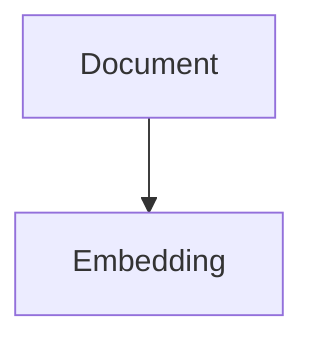

# FileRaven 🦅

FileRaven is a powerful document Q&A system that uses Retrieval-Augmented Generation (RAG) to provide intelligent answers to questions about your documents.



## Features

- 📄 Support for multiple document formats (PDF, DOCX, TXT)
- 🔄 Automatic conversion to markdown
- 🧮 Advanced text embedding using sentence-transformers
- 💾 Efficient vector storage with ChromaDB
- 🤖 RAG-based response generation using Ollama
- 💬 Interactive chat interface with conversation history

## Installation

```bash
pip install fileraven
```

## Quick Start

1. Install and start Ollama:
   ```bash
      # Follow instructions at https://ollama.ai/
         ollama pull llama2
            ```

            2. Start the FileRaven API:
               ```bash
                  fileraven-api
                     ```

                     3. Start the FileRaven UI:
                        ```bash
                           fileraven-ui
                              ```

                              4. Open your browser and navigate to http://localhost:8501

                              ## Configuration

                              FileRaven can be configured using environment variables:

                              - `FILERAVEN_API_URL`: URL of the FileRaven API (default: http://localhost:8000)
                              - `FILERAVEN_MODEL`: Ollama model to use (default: llama2)
                              - `FILERAVEN_DB_PATH`: Path to store the vector database (default: ./db)

                              ## Development

                              1. Clone the repository:
                                 ```bash
                                    git clone https://github.com/yourusername/fileraven.git
                                       cd fileraven
                                          ```

                                          2. Create a virtual environment:
                                             ```bash
                                                python -m venv venv
                                                   source venv/bin/activate  # On Windows: venv\Scripts\activate
                                                      ```

                                                      3. Install development dependencies:
                                                         ```bash
                                                            pip install -e ".[dev]"
                                                               ```

                                                               4. Run tests:
                                                                  ```bash
                                                                     pytest
                                                                        ```

                                                                        ## License

                                                                        This project is licensed under the MIT License - see the LICENSE file for details.

https://visualstudio.microsoft.com/visual-cpp-build-tools/
                                                                        